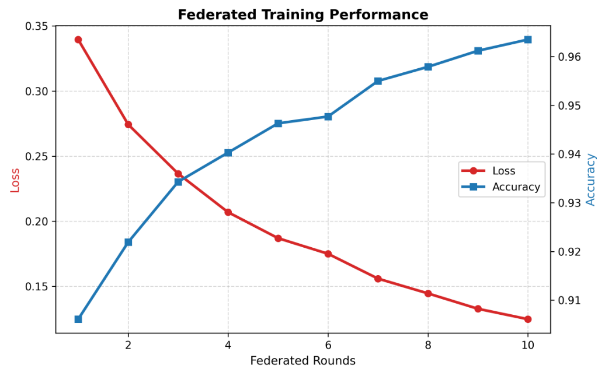
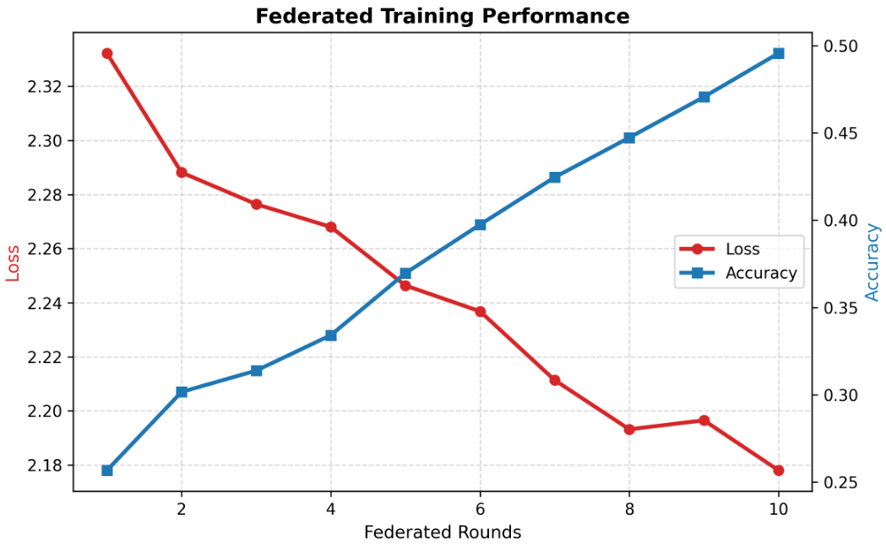

<h1>Federated Learning with IID and Non-IID Partitioning</h1>

This project implements a federated learning simulation using the
<strong>Flower (FLWR)</strong> framework on the <strong>MNIST</strong> dataset.
The primary objective is to study how different data partitioning strategies
impact model convergence and performance in federated settings.

<h2>Project Overview</h2>

In federated learning, training data remains decentralized across multiple
clients. Each client performs local training on its private data and only
shares model updates with a central server.

This repository demonstrates:

<ul>
  <li>Federated training on MNIST using Flower</li>
  <li>Client-side PyTorch model training</li>
  <li>Configurable data distribution strategies:
    <ul>
      <li>IID (Independent and Identically Distributed)</li>
      <li>Non-IID (Label-skewed, equal data size)</li>
      <li>Non-IID Unequal (Label-skewed, unequal data size)</li>
    </ul>
  </li>
  <li>Quantitative comparison using accuracy and loss curves</li>
</ul>

<h2>Technologies Used</h2>

<ul>
  <li><strong>Python 3.10+</strong></li>
  <li><strong>PyTorch</strong> – model definition and training</li>
  <li><strong>Flower (flwr)</strong> – federated learning framework</li>
  <li><strong>Ray</strong> – client simulation backend</li>
  <li><strong>NumPy</strong> – data manipulation</li>
  <li><strong>Matplotlib</strong> – visualization</li>
</ul>

<h2>Code Structure</h2>

<table>
  <tr>
    <th>File</th>
    <th>Description</th>
  </tr>
  <tr>
    <td><code>server.py</code></td>
    <td>Federated server configuration and aggregation strategy</td>
  </tr>
  <tr>
    <td><code>client.py</code></td>
    <td>Flower client implementation and local training logic</td>
  </tr>
  <tr>
    <td><code>dataset.py</code></td>
    <td>MNIST loading and data partitioning functions</td>
  </tr>
  <tr>
    <td><code>train.py</code></td>
    <td>Local PyTorch training and evaluation loop</td>
  </tr>
  <tr>
    <td><code>model.py</code></td>
    <td>Neural network architecture used for MNIST classification</td>
  </tr>
  <tr>
    <td><code>pyproject.toml</code></td>
    <td>Project metadata and dependency management</td>
  </tr>
</table>

<h2>Data Partitioning Strategies</h2>

<h3>1. IID Partitioning</h3>

In IID partitioning, the MNIST dataset is randomly shuffled and evenly divided
among all clients. Each client receives a representative subset containing
samples from all classes.

This setup typically results in:

<ul>
  <li>Stable convergence</li>
  <li>Higher final accuracy</li>
  <li>Low variance across clients</li>
</ul>

<h3>2. Non-IID Partitioning (Equal)</h3>

In this setting, each client is assigned data from only a small subset of
classes, while the total number of samples per client remains equal.

This simulates realistic federated scenarios where user data is biased
towards specific labels.

<h3>3. Non-IID Partitioning (Unequal)</h3>

Clients receive both different label distributions and different numbers of
samples. This is the most challenging configuration and closely reflects
real-world federated learning environments.

<h2>Results Comparison</h2>
<table>
  <tr>
    <td align="center">
       
      <strong>IID Distribution</strong>
    </td>
    <td align="center">
       
      <strong>Non-IID Distribution (Equal)</strong>
    </td>
  </tr>
</table>

<h2>Comparison and Discussion</h2>

The experimental results clearly show that IID data distribution leads to
faster convergence and higher final accuracy. As the data becomes more
heterogeneous in the Non-IID settings, convergence slows, and performance
degrades.

The unequal Non-IID scenario exhibits the highest instability due to both
label skew and data quantity imbalance, highlighting the inherent challenges
of federated learning in realistic environments.

<h2>Conclusion</h2>

This project provides a controlled experimental framework for analyzing
the impact of data heterogeneity in federated learning. It can be extended
to other datasets, models, or aggregation strategies for further research.

